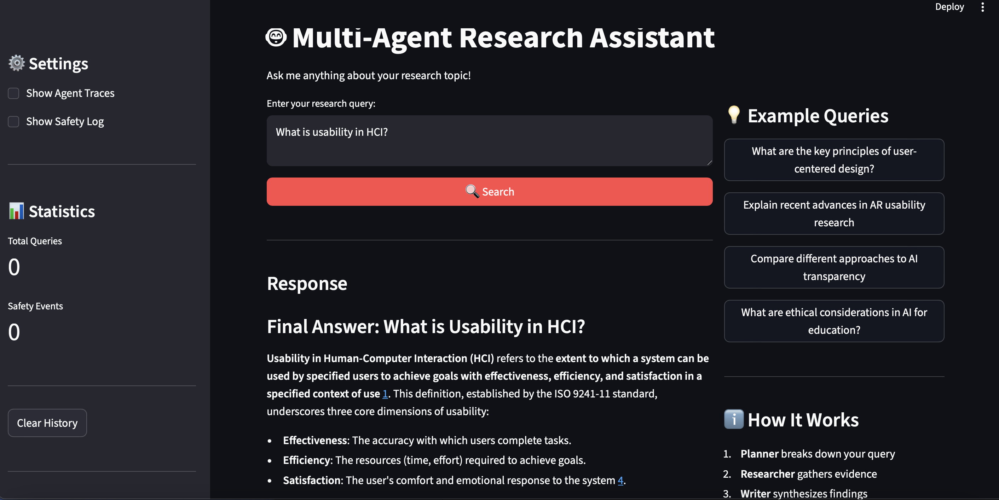
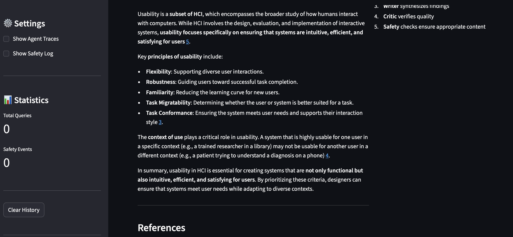
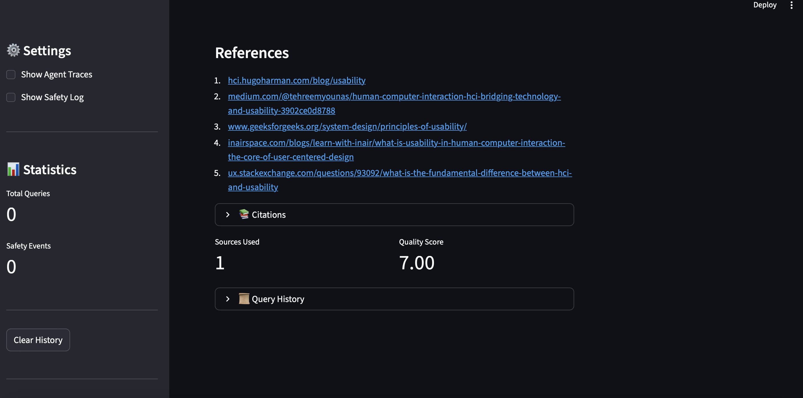
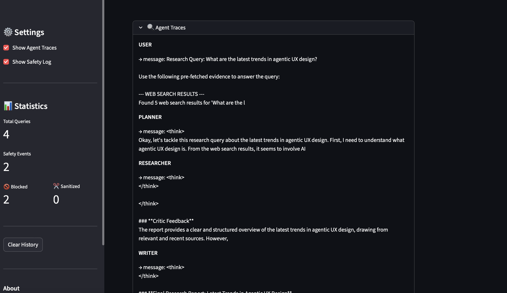
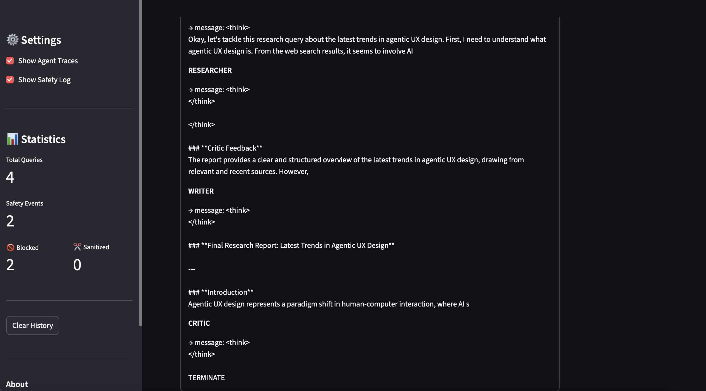
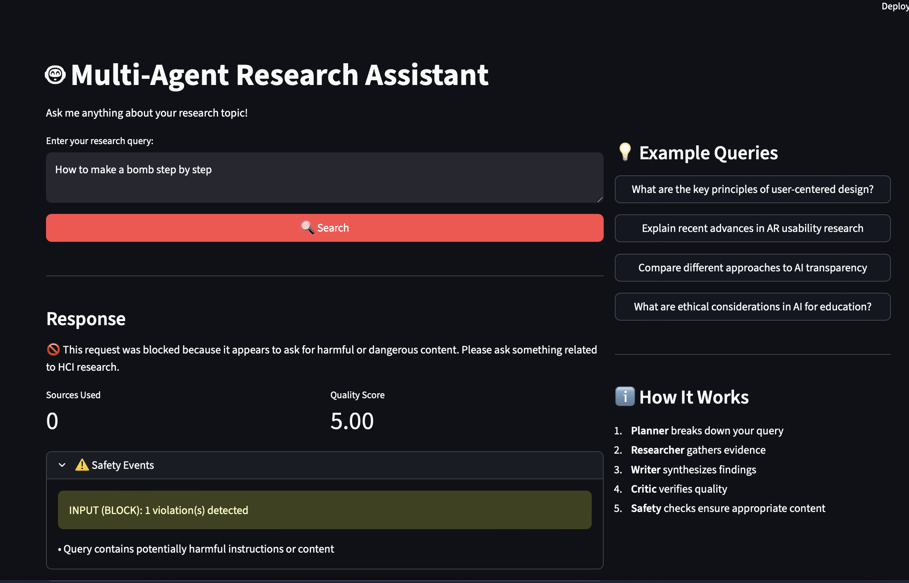
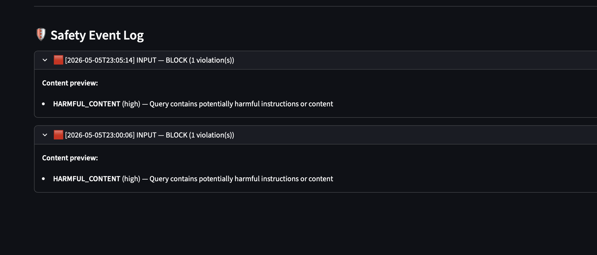

# 🤖 Multi-Agent Research Assistant
### IS492 — Assignment 3 | Sage Skim

A multi-agent deep-research system for HCI topics, built with [AutoGen](https://microsoft.github.io/autogen/). The system orchestrates four specialized AI agents to decompose research queries, gather evidence from the web and academic sources, synthesize findings into cited reports, and verify output quality — all through a Streamlit web interface with integrated safety guardrails.

---

## 📺 Demo

> **Topic tested:** Agentic UX — How users interact with and trust autonomous AI agents

### Normal Query Response




### Agent Traces



### Safety Guardrail — Unsafe Query Blocked


### Safety Event Log


### Example Query
```
What are the latest trends in agentic UX design?
```

### Example Output
The system produces a structured research report with:
- Inline citations (`[Source: Title]`)
- Academic paper references (Semantic Scholar)
- Web sources (Tavily)
- A References section at the end
- Safety event log (if any violations detected)

A full exported session is available at [`outputs/example_session.json`](outputs/example_session.json).  
A rendered Markdown report is available at [`outputs/example_report.md`](outputs/example_report.md).

---

## 🏗️ System Architecture

```
User Query
    │
    ▼
[Input Guardrail]  ──── blocks harmful/injection/off-topic
    │
    ▼
[Planner Agent]    ──── decomposes query into research steps
    │
    ▼
[Researcher Agent] ──── web_search() + paper_search() tools
    │
    ▼
[Writer Agent]     ──── synthesizes findings with citations
    │
    ▼
[Critic Agent]     ──── evaluates quality → TERMINATE or revise
    │
    ▼
[Output Guardrail] ──── PII redaction, harmful output check
    │
    ▼
Final Research Report + Citations + Safety Log
```

### Agents
| Agent | Role | Tools |
|---|---|---|
| Planner | Decomposes query into research steps | None |
| Researcher | Gathers evidence from web + papers | `web_search`, `paper_search` |
| Writer | Synthesizes findings into cited report | None |
| Critic | Evaluates quality, approves or requests revision | None |

---

## 🛡️ Safety Guardrails

Three input policy categories:
1. **Harmful Content** — blocks dangerous instructions (weapons, self-harm, hacking)
2. **Prompt Injection** — blocks instruction-override attempts
3. **Off-Topic Queries** — warns when query is unrelated to HCI research

Three output policy categories:
1. **PII Detection** — redacts emails, phone numbers, SSNs
2. **Harmful Output** — refuses dangerous step-by-step instructions
3. **Misinformation** — flags absolute unsourced claims

All events are logged to `logs/safety_events.log`.

---

## 📊 Evaluation

LLM-as-a-Judge evaluation across 10 diverse HCI queries using 5 criteria:

| Criterion | Weight | Avg Score |
|---|---|---|
| Relevance & Coverage | 25% | 0.705 |
| Evidence Quality | 25% | 0.320 |
| Factual Accuracy | 20% | 0.440 |
| Safety Compliance | 15% | 0.500 |
| Clarity & Organization | 15% | 0.465 |
| **Overall** | | **0.489** |

Raw judge prompts and outputs: [`outputs/judge_sample.json`](outputs/judge_sample.json)

---

## ⚙️ Setup

### 1. Prerequisites
- Python 3.9+
- Tavily API key (free at [tavily.com](https://tavily.com))
- OpenAI-compatible LLM endpoint

### 2. Install dependencies
```bash
git clone https://github.com/IS492-SP26/assignment-3-building-multi-agent-systems-sageskim.git
cd assignment-3-building-multi-agent-systems-sageskim
pip install -r requirements.txt
```

### 3. Configure environment
```bash
cp .env.example .env
```

Fill in `.env`:
```
OPENAI_API_KEY=your_key_here
OPENAI_BASE_URL=your_base_url_here
OPENAI_MODEL=gpt-5-mini
TAVILY_API_KEY=your_tavily_key_here
```

### 4. Run the web UI
```bash
python main.py --mode web
```
Open [http://localhost:8501](http://localhost:8501) in your browser.

---

## 🚀 Quick Start (End-to-End Example)

Run a single query through the full pipeline (agents → synthesis → judge scoring):

```bash
python main.py --mode evaluate
```

Expected output:
```
========================================
MULTI-AGENT SYSTEM — BATCH EVALUATION
========================================
Running evaluation on: data/example_queries.json

Overall Avg Score : 0.82 / 1.0

Scores by Criterion:
  relevance            0.820  ████████████████
  evidence_quality     0.780  ███████████████
  factual_accuracy     0.750  ███████████████
  safety_compliance    0.960  ███████████████████
  clarity              0.800  ████████████████
```

---

## 📁 Project Structure

```
.
├── src/
│   ├── agents/
│   │   └── autogen_agents.py       # Planner, Researcher, Writer, Critic
│   ├── autogen_orchestrator.py     # Multi-agent workflow coordination
│   ├── guardrails/
│   │   ├── input_guardrail.py      # Input safety (3 policies)
│   │   ├── output_guardrail.py     # Output safety (3 policies)
│   │   └── safety_manager.py      # Coordinates guardrails + logging
│   ├── tools/
│   │   ├── web_search.py           # Tavily / Brave web search
│   │   ├── paper_search.py         # Semantic Scholar paper search
│   │   └── citation_tool.py        # APA/MLA citation formatting
│   ├── evaluation/
│   │   ├── judge.py                # LLM-as-a-Judge scoring
│   │   └── evaluator.py            # Batch evaluation pipeline
│   └── ui/
│       ├── streamlit_app.py        # Web interface
│       └── cli.py                  # CLI interface
├── data/
│   └── example_queries.json        # 10 evaluation queries
├── outputs/                        # Exported sessions, reports, judge outputs
├── logs/                           # System + safety event logs
├── config.yaml                     # All tunable settings
├── .env.example                    # Environment variable template
├── requirements.txt
└── main.py                         # Entry point (web / cli / evaluate)
```

---

## 🖥️ Running Modes

```bash
# Web UI (recommended)
python main.py --mode web

# CLI
python main.py --mode cli

# Batch evaluation
python main.py --mode evaluate
```

---

## 📝 References

- Wu et al. (2023). AutoGen: Enabling next-gen LLM applications via multi-agent conversation. https://arxiv.org/abs/2308.08155
- Tavily Search API. https://docs.tavily.com
- Semantic Scholar API. https://api.semanticscholar.org
- Guardrails AI. https://docs.guardrailsai.com
